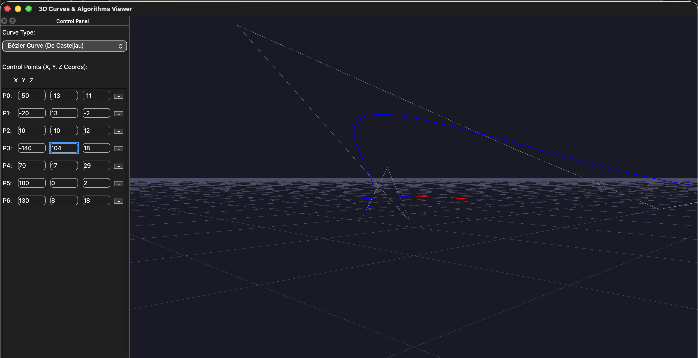

# 📐 Qt 3D Curve Visualizer: Bézier, Spline, and Hermite Renderer



An interactive, cross-platform 3D visualization tool built with **C++** and **Qt6** for exploring parametric curves. This project demonstrates modern OpenGL rendering techniques within a robust desktop application.

---

## ✨ Features

This application allows users to dynamically create and manipulate 3D curves while showcasing essential modern OpenGL practices.

* **Interactive 3D Viewport:** Full camera control via mouse:
    * **Rotation (Orbit):** Right-click drag.
    * **Zoom:** Mouse wheel scroll.
    * **Panning (Translate):** Middle-click drag.
* **Modern OpenGL Rendering:** Implements the **OpenGL Core Profile** using **Vertex Buffer Objects (VBOs)** and **Shaders** (via `QOpenGLShaderProgram`) to ensure compatibility with modern operating systems (like macOS) and graphics hardware, avoiding the deprecated Fixed-Function Pipeline.
* **Multiple Curve Types:** Supports real-time visualization of:
    * **Bézier Curves** (using De Casteljau's algorithm).
    * **Uniform Cubic B-Splines**.
    * **Hermite Curves** (implemented via Catmull-Rom formulation for continuous segments).
* **Dynamic Control:** Add, remove, and drag control points directly in the 3D viewport or by editing X, Y, and Z coordinates in the control panel.
* **Enhanced Visualization:**
    * **Collapsible Control Panel** (`QDockWidget`) to maximize 3D viewing space.
    * **3D Grid Surface** and **XYZ Axes** for accurate depth and orientation cues.
    * **Control Polygon** displayed as a dashed line connecting the control points.

---

## 🚀 Getting Started

### Prerequisites

You need a C++ compiler and the Qt development environment installed.

* **C++ Compiler:** (e.g., GCC, Clang, MSVC)
* **Qt 6:** The project requires the following modules: `Core`, `Gui`, `Widgets`, `OpenGL`, and `OpenGLWidgets`.
* **CMake:** Used for project configuration.

### Building the Project (CMake)

1.  **Clone the Repository:**
    ```bash
    git clone [https://github.com/OresteGabo/qt-bezier-spline-visualizer.git](https://github.com/OresteGabo/qt-bezier-spline-visualizer.git)
    cd qt-bezier-spline-visualizer
    ```

2.  **Create and Enter Build Directory:**
    ```bash
    mkdir build
    cd build
    ```

3.  **Configure and Build:**
    Assuming your Qt6 environment is sourced/configured, run CMake and build the executable.
    ```bash
    # Configure the project with CMake (adjust path to Qt6 if necessary)
    cmake ..

    # Compile the project
    cmake --build .
    ```

4.  **Run the Application:**
    The executable is usually located in the `build` directory or a subdirectory like `build/bin/`.
    ```bash
    # Example command (may vary by OS/CMake settings)
    ./curves3D 
    ```

---

## 🛠️ Implementation Details

### Core Files

| File | Responsibility |
| :--- | :--- |
| `DrawingArea.cpp/.h` | **The 3D Canvas.** Handles all OpenGL initialization (`initializeGL`), rendering (`paintGL`), shader management, VBO setup, and mouse interaction for rotation/panning/dragging. |
| `curvecalculator.cpp/.h` | **The Algorithm Engine.** Contains the C++ logic for calculating the thousands of curve points using Bézier, B-Spline, and Hermite formulas with `QVector3D`. |
| `mainwindow.cpp/.h` | **The Main Window.** Sets up the `QMainWindow`, manages the `QDockWidget` control panel, and synchronizes input fields with the `PointModel` and `DrawingArea`. |

### Modern OpenGL Highlights

The project explicitly addresses the deprecation of the OpenGL Fixed-Function Pipeline by using:

* `QOpenGLFunctions`: For accessing the necessary core OpenGL functions.
* `QOpenGLShaderProgram`: For compiling and linking simple Vertex and Fragment Shaders.
* `QOpenGLBuffer`: For storing vertex data (curve points, axes, grid) in **Vertex Buffer Objects (VBOs)**, ensuring efficient rendering.

---

## 🤝 Contribution

Feel free to open an issue or submit a pull request if you have suggestions for new features (e.g., non-uniform splines, surface rendering) or improvements.
